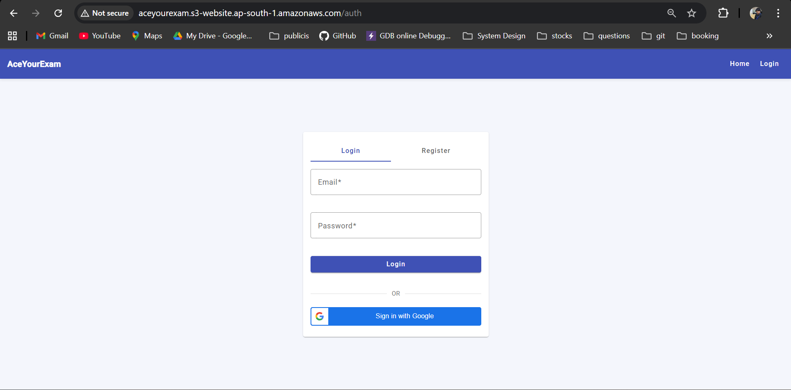
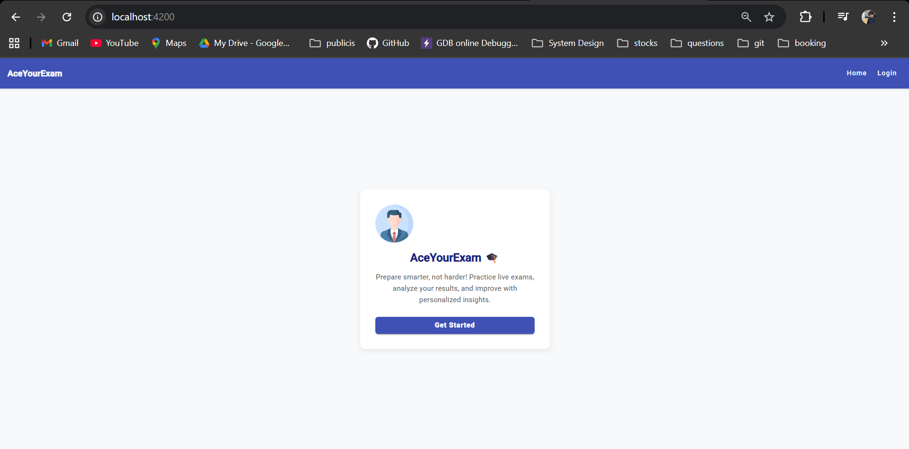
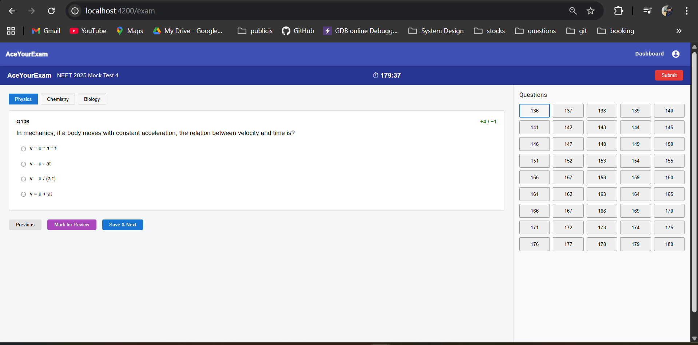
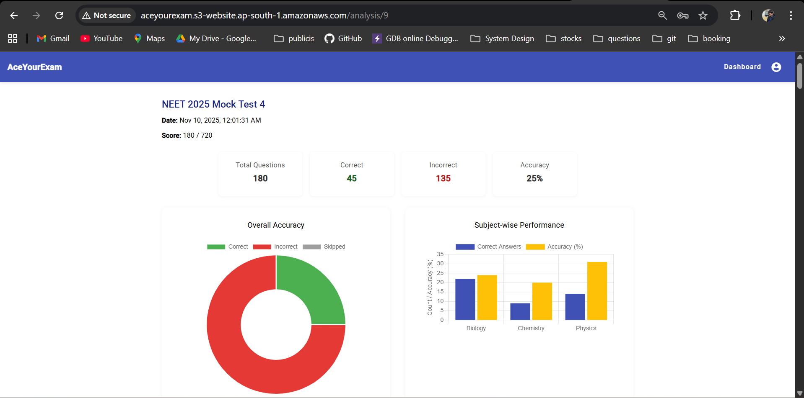
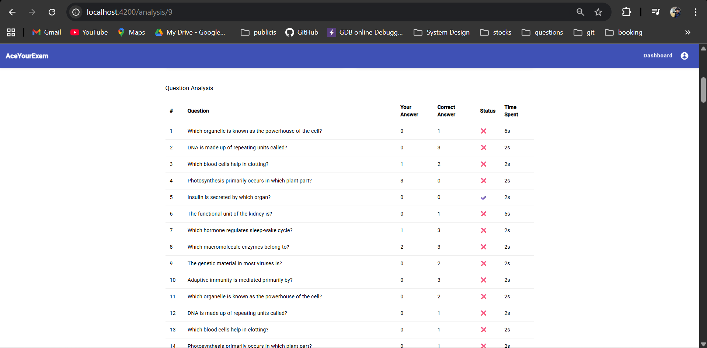
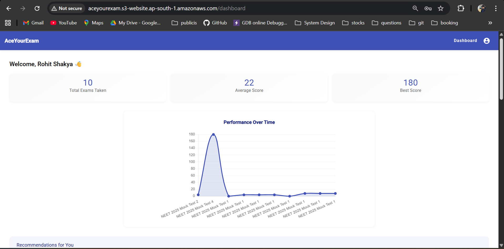
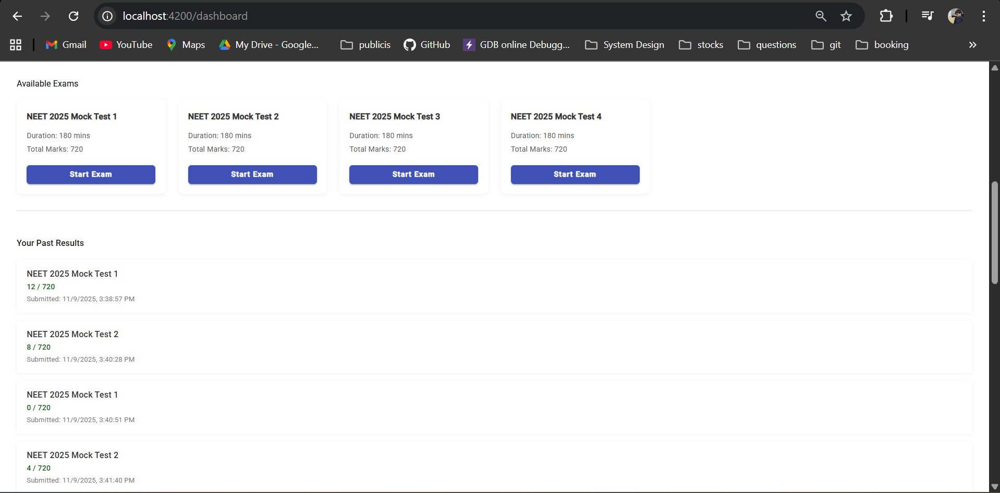
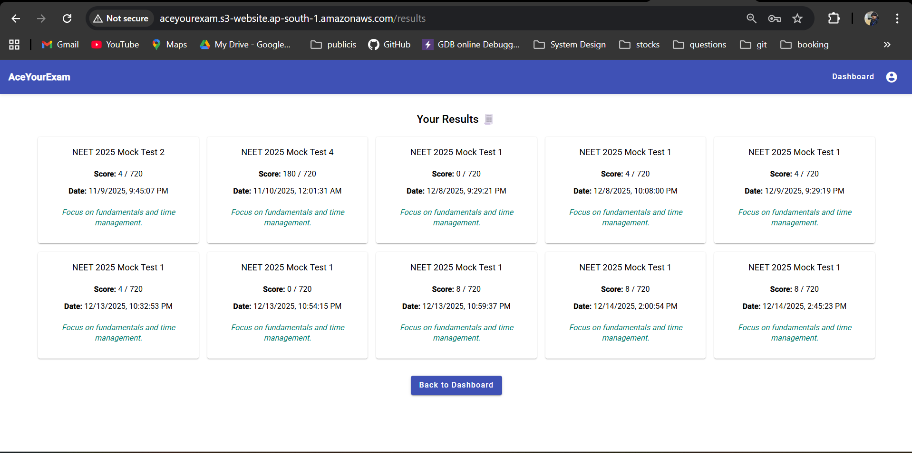
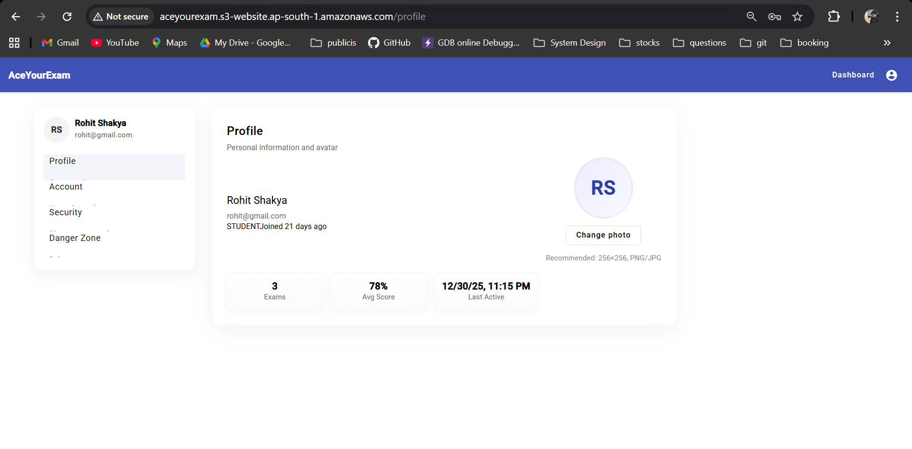

# 🎯 AceYourExam – Online Examination & Performance Analytics Platform

**AceYourExam** is a full-stack web application designed to simulate **real competitive exam environments** (such as NEET) and help students **practice effectively, analyze performance deeply, and track progress over time**.  
The platform focuses on **exam realism, accuracy, and detailed analytics**, providing an end-to-end online testing experience.

---

## 🚀 Tech Stack

| Frontend | Backend | Database | Authentication |
|--------|--------|----------|----------------|
| Angular (Standalone APIs), Angular Material | Spring Boot | PostgreSQL (JPA / Hibernate) | JWT (Role-based) |

---

## 🏗️ Application Architecture

🌐 Angular Single Page Application ↓  
⚙️ Spring Boot REST APIs ↓  
🗄️ PostgreSQL Database  

- Stateless JWT-based authentication  
- Role-based authorization (**STUDENT / ADMIN**)  
- Clean layered architecture (Controller → Service → Repository)  
- Global exception handling & secure API access  
- Centralized error handling with consistent API responses  
- Request tracing using unique Request IDs  
- AOP-based logging for better observability and debugging
---

## ☁️ Production Deployment (AWS)

AceYourExam is deployed on AWS using a **clean, production-style architecture** with clear separation between frontend, backend, and database.

- **Frontend**
  - Angular application hosted as a **static website on Amazon S3**

- **Backend**
  - Spring Boot REST APIs deployed on **AWS EC2**
  - **Nginx** used as a reverse proxy for API traffic

- **Database**
  - PostgreSQL hosted on **AWS RDS**
  - Deployed in a **private subnet**
  - Database access restricted via Security Groups (EC2 → RDS only)

- **Data Migration**
  - Local PostgreSQL data migrated to AWS RDS using `pg_dump` / `pg_restore` via EC2

- **Cost Considerations**
  - Free-tier friendly setup (EC2, RDS, S3)
  - No load balancers or NAT gateways

---

## 🔐 Authentication & Security

AceYourExam implements a **production-grade authentication system** with both traditional and modern login flows.

- 🔑 **Email & Password Authentication**
  - Secure login and registration
  - Passwords stored using strong hashing
  - JWT-based stateless session management

- 🟢 **Google OAuth 2.0 Login**
  - One-click login using Google account
  - Secure ID token verification on backend
  - Automatic user provisioning for first-time Google users
  - Seamless fallback to JWT-based authorization after login

- 🛡️ **Security & Access Control**
  - JWT token generation and validation
  - Role-based authorization (**STUDENT / ADMIN**)
  - Custom authentication filter (`JwtAuthenticationFilter`)
  - Secure endpoint access via Spring Security
  - Route protection using Angular guards

---

## 📝 Exam Lifecycle (Backend Flow)

1. **Admin creates Exam & Questions**
2. **Student starts an exam**
3. Questions are fetched subject-wise
4. Student submits answers (auto-saved)
5. Exam auto-submits on timeout
6. Evaluation logic calculates score & accuracy
7. Results and analysis are generated and stored

---

## 📸 UI Screenshots

### Authentication & Home

| Login | Home |
|------|------|
|  |  |

---

### Exam Runner (Real Exam Mode)

| Exam Interface |
|---------------|
|  |

- NEET-style layout with up to 180 questions  
- Subject tabs (Physics / Chemistry / Biology)  
- Mark for Review, Save & Next, Timer  

---

### Result Analysis

| Summary & Charts | Question-wise Analysis |
|-----------------------|------------------|
|  |  |

---

### Dashboard & Progress Tracking

| Performance Over Time | Past Results |
|-------------------|----------------------|
|  |  |

---

### Results History

| Past Attempts |
|--------------|
|  |

---

### User Profile

| Profile Page |
|-------------|
|  |

---

## ✅ Features

- 🔐 **Secure Authentication**
  - Email & password login
  - Google OAuth 2.0 login (One-click sign-in)
  - JWT-based session handling
  - Role-based access control

- 📝 **Real Exam Experience**
  - Timed exams with auto-submit
  - Subject-wise navigation
  - Question palette (Attempted / Unattempted / Marked for Review)
  - Persistent answers during navigation

- 📊 **Advanced Performance Analytics**
  - Overall accuracy calculation
  - Subject-wise performance breakdown
  - Question-level correctness analysis
  - Time spent per question

- 📈 **Dashboard & Progress Tracking**
  - Best & average score
  - Performance trend graph
  - Attempt history

- 👤 **Profile Management**
  - User details
  - Avatar support
  - Exam statistics

- 🧩 **Scalable Backend**
  - RESTful APIs
  - DTO-based responses
  - Modular security configuration

---

## 🌟 Notable Engineering Highlights

- Implemented **Google OAuth 2.0 login** with backend ID token verification
- Designed a **stateless authentication flow** combining OAuth + JWT
- Built with **clean separation of concerns** (Controller → Service → Repository)
- Handles real-world exam constraints (timeouts, autosave, auto-submit)
- Scales cleanly for large exams (e.g., 180-question NEET simulations)

---

## 📦 Project Setup

### 1. Clone Repositories

```bash
git clone https://github.com/your-username/aceyourexam-frontend.git
git clone https://github.com/your-username/aceyourexam-backend.git
```

---

### 2. Run Frontend (Angular)

```bash
cd aceyourexam-frontend
npm install
ng serve
```

Frontend will be available at  
👉 `http://localhost:4200`

---

### 3. Run Backend (Spring Boot)

```bash
cd ../aceyourexam-backend
./mvnw spring-boot:run
```

Backend APIs will be available at  
👉 `http://localhost:8080`

---

## 📁 Folder Structure (Frontend)

```
aceyourexam-frontend/
├── src/app/
│   ├── components/
│   │   ├── auth/
│   │   ├── dashboard/
│   │   ├── exam/
│   │   ├── analysis/
│   │   ├── results/
│   │   └── profile/
│   ├── services/
│   ├── guards/
│   ├── interceptors/
│   └── app.routes.ts
├── screenshots/
└── README.md
```

---

## 🌱 Future Enhancements

- Negative marking support
- Section-wise exams
- Leaderboards & rankings
- Difficulty-based analytics
- Mobile-first exam experience

---

## 👨‍💻 Author

**Rohit Shakya**  
📍 Senior Software Engineer  
📧 rohitshakya930@gmail.com  
🔗 LinkedIn: https://www.linkedin.com/in/rohitshakya  
🌐 Portfolio: https://shakya-rohit.github.io  

---

## ⭐️ Support & Feedback

If you find this project useful, feel free to ⭐ star it on GitHub.  
Feedback, suggestions, and contributions are welcome!
