# 🎯 AceYourExam – Online Examination & Performance Analytics Platform

**AceYourExam** is a full-stack web platform designed to simulate **real competitive exam environments** (like NEET / JEE) and help students **practice effectively, analyze performance deeply, and track progress over time**.

The platform provides:

- Realistic **exam simulation**
- **Custom practice tests**
- **Advanced performance analytics**
- **Admin exam management tools**

It aims to replicate the **complete lifecycle of online testing platforms** used by modern EdTech systems.

---

# 🚀 Tech Stack

| Frontend                                    | Backend     | Database                     | Authentication     | Infrastructure          |
| ------------------------------------------- | ----------- | ---------------------------- | ------------------ | ----------------------- |
| Angular (Standalone APIs), Angular Material | Spring Boot | PostgreSQL (JPA / Hibernate) | JWT + Google OAuth | Docker, Kubernetes, AWS |

---

# 🏗️ Application Architecture

Angular SPA
↓
Spring Boot REST APIs
↓
PostgreSQL Database

Key architectural decisions:

- Stateless **JWT authentication**
- **Role-based authorization** (STUDENT / ADMIN)
- Clean layered architecture  
  `Controller → Service → Repository`
- Global exception handling
- Request tracing with **unique Request IDs**
- **AOP-based logging** for observability

---

# ☁️ Production Deployment (AWS)

AceYourExam is deployed using a **production-style cloud architecture**.

### Frontend

- Angular app hosted on **Amazon S3 (static website)**

### Backend

- Spring Boot APIs deployed on **AWS EC2**
- **Nginx reverse proxy** for API traffic

### Database

- **PostgreSQL on AWS RDS**
- Deployed inside **private subnet**
- Database access restricted using **Security Groups**

### Data Migration

Local PostgreSQL data migrated using:
pg_dump
pg_restore

### Cost Optimization

- Free-tier friendly setup
- No load balancers or NAT gateways

---

# 🐳 Containerization & Kubernetes

The platform also supports **containerized deployments**.

### Docker

Both frontend and backend are containerized.

Frontend container:

- Angular static build served using **Nginx**

Backend container:

- Runs **Spring Boot REST APIs**

### Kubernetes

Kubernetes manifests are provided to deploy the system.

Includes:

- Deployment
- Service
- Scalable backend pods

Deployment flow:
Docker Build
↓
Kubernetes Deployment
↓
Multiple backend pods
↓
Service Load Balancing

---

# 🔐 Authentication & Security

AceYourExam implements a **secure authentication system**.

### Email & Password Authentication

- Secure login and registration
- Password hashing
- JWT-based stateless authentication

### Google OAuth 2.0 Login

- One-click login using Google
- Backend ID token verification
- Automatic account creation for first-time users

### Security Controls

- JWT authentication filter
- Role-based authorization
- Angular route guards
- Secure API endpoints

Supported roles:
STUDENT
ADMIN

---

# 👨‍🎓 Student Features

## 🧪 Custom Practice Tests

Students can generate **custom practice exams**.

Options include:

- Random question selection
- Difficulty-based selection
- Instant feedback or feedback at end
- Timed or untimed mode
- Custom question count

Also supports **Quick Topic Practice** such as:

- Optics
- Thermodynamics
- Magnetism

---

## 📝 Real Exam Simulation

Full exam experience including:

- Timed exams
- Subject navigation (Physics / Chemistry / Biology)
- Question palette
- Mark for review
- Auto-save answers
- Auto-submit on timeout

Supports large exams such as **180-question NEET simulations**.

---

## 📊 Advanced Performance Analytics

After exam completion the platform provides:

- Overall score and accuracy
- Subject-wise performance
- Question-level correctness analysis
- Time spent per question
- Attempt history

---

## 📈 Dashboard & Progress Tracking

Dashboard visualizes performance trends across attempts.

Includes:

- Best score
- Average score
- Performance trend graph
- Historical exam attempts

---

## 👤 Profile Management

Students can manage:

- Profile details
- Avatar
- Exam statistics

---

# 🛠️ Admin Features

## 📚 Question Bank Management

Admins maintain a centralized **question repository**.

Each question supports:

- Question text
- Multiple options
- Correct option index
- Subject
- Topic
- Difficulty level (Easy / Medium / Hard)
- Marks

Admin capabilities:

- Add questions
- Edit questions
- Delete questions
- Filter by subject
- Filter by difficulty
- Search questions

---

## 📝 Multi-Step Exam Creation Workflow

Admins create exams using a **4-step workflow**:

1. Exam Details
2. Add Questions
3. Review Configuration
4. Publish Exam

Admins can configure:

- Exam title
- Duration
- Exam type
- Description
- Question selection

---

# 📸 UI Screenshots

## Authentication & Home

| Login                           | Home                          |
| ------------------------------- | ----------------------------- |
| 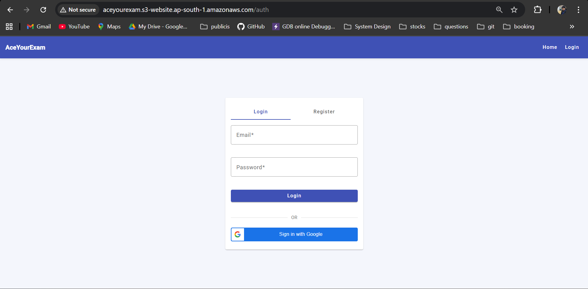 | 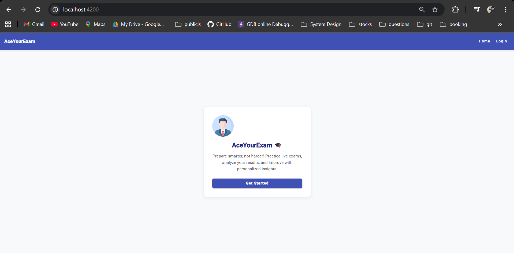 |

---

## Prepare Practice Test

| Practice Test Builder             | Practice Test Runner              |
| --------------------------------- | --------------------------------- |
| 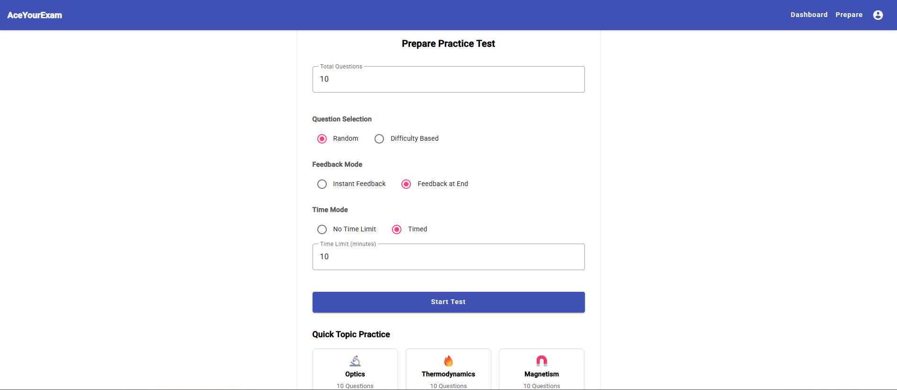 | 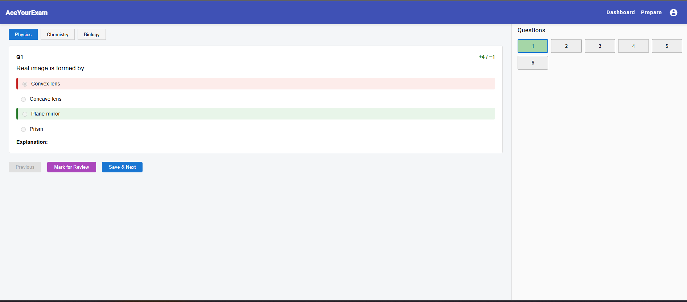 |

Students can configure practice tests with difficulty, timing, and question selection.

---

## Exam Runner

| Exam Interface                |
| ----------------------------- |
| 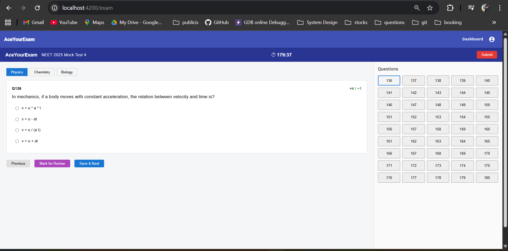 |

Realistic exam interface with subject navigation and timer.

---

## Result Analysis

| Summary                                        | Question Analysis                              |
| ---------------------------------------------- | ---------------------------------------------- |
| 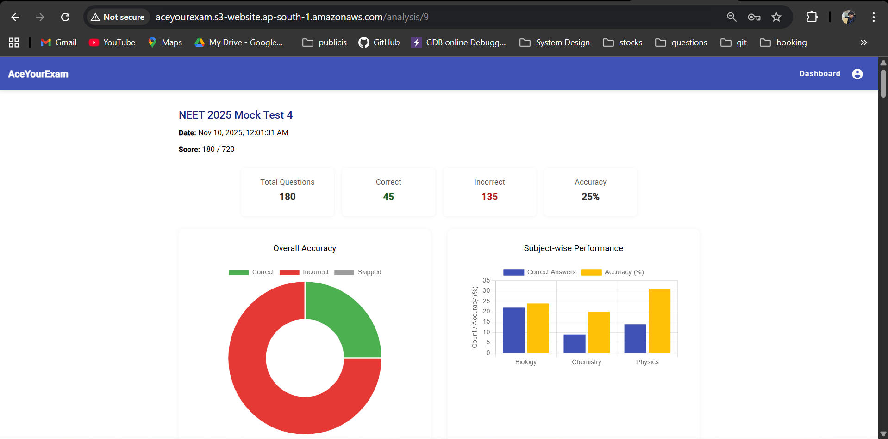 | 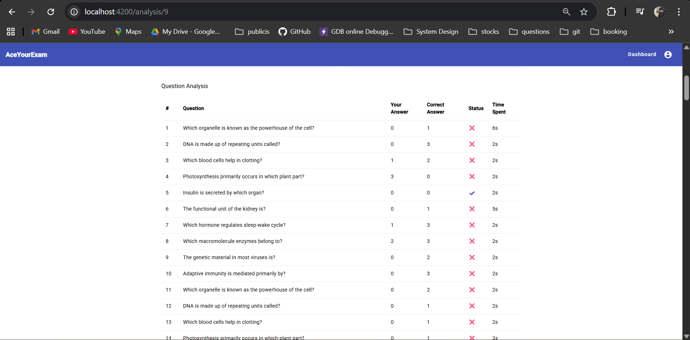 |

---

## Dashboard

| Performance Tracking                     | Exam History                             |
| ---------------------------------------- | ---------------------------------------- |
| 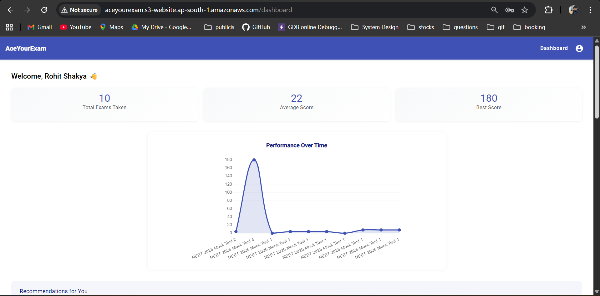 | 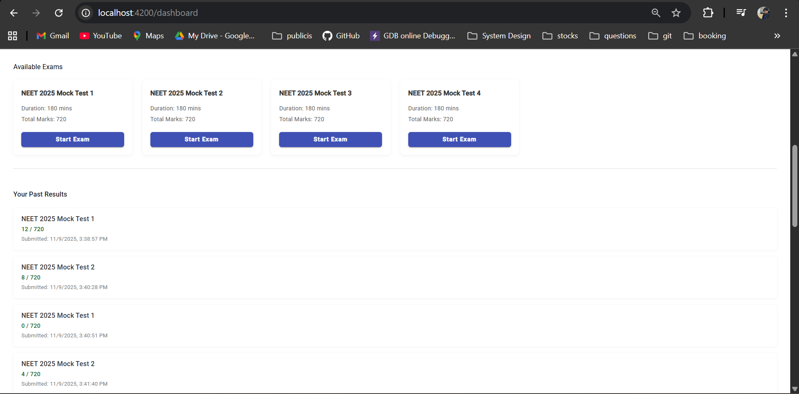 |

---

## Admin Question Bank

| Question Bank                                | Question Bank List                           |
| -------------------------------------------- | -------------------------------------------- |
| 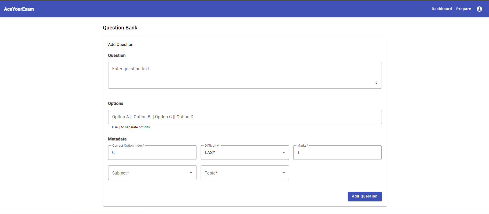 | 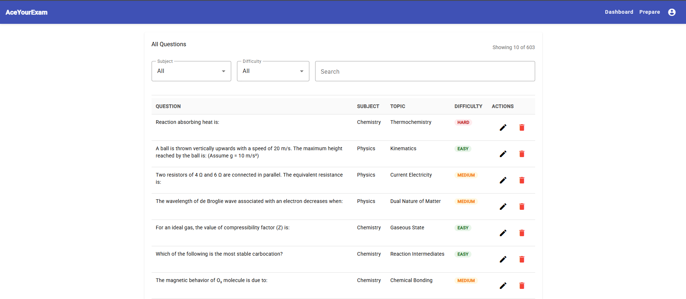 |

---

## Exam Creation

| Exam Builder                                 |
| -------------------------------------------- |
| 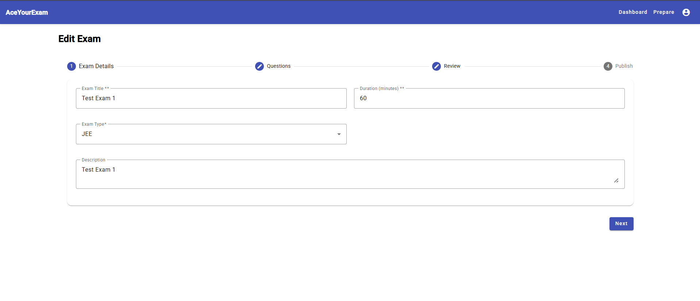 |

---

# 📝 Exam Lifecycle (Backend Flow)

Admin creates exam
↓
Student starts exam
↓
Questions fetched subject-wise
↓
Answers saved during exam
↓
Exam auto-submits on timeout
↓
Evaluation calculates score
↓
Results & analytics generated

---

# 📦 Project Setup

## Clone Repositories

git clone https://github.com/your-username/aceyourexam-frontend.git

## git clone https://github.com/your-username/aceyourexam-backend.git

## Run Frontend

cd aceyourexam-frontend
npm install
ng serve

Frontend runs at:

http://localhost:4200

---

## Run Backend

cd aceyourexam-backend
./mvnw spring-boot:run

Backend runs at:

http://localhost:8080

---

# 📁 Frontend Structure

aceyourexam-frontend/
├── src/app
│ ├── auth
│ ├── dashboard
│ ├── exam
│ ├── analysis
│ ├── results
│ ├── prepare
│ ├── admin
│ │ ├── question-bank
│ │ └── exam-builder
│ ├── services
│ ├── guards
│ └── interceptors

---

# 🌱 Future Enhancements

- Negative marking
- Section-wise exams
- Leaderboards
- Difficulty-based analytics
- Mobile-first exam interface
- AI-based performance insights

---

# 👨‍💻 Author

**Rohit Shakya**  
Senior Software Engineer

📧 rohitshakya930@gmail.com

🔗 LinkedIn  
https://www.linkedin.com/in/rohitshakya

🌐 Portfolio  
https://shakya-rohit.github.io

---

# ⭐ Support

If you find this project useful, please consider **starring the repository** ⭐

Feedback and contributions are welcome.
